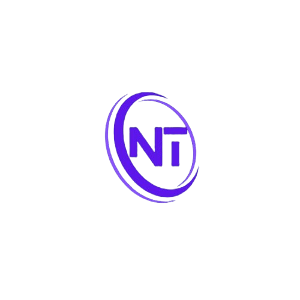

# NexaTechX Portfolio 

<div align="center">
  
  <h3>A Mystical Web Development Journey</h3>
</div>

## Overview

Welcome to my enchanted portfolio! This is a magical realm crafted with Next.js 14, where modern web development meets mystical design. Experience a journey through my projects, skills, and creative endeavors.

## Features

- **Immersive 3D Elements** - Interactive 3D models bringing magic to life
- **Responsive Design** - Seamless experience across all devices
- **Dynamic GitHub Stats** - Real-time display of my coding journey
- **Animated Transitions** - Smooth, enchanting page transitions
- **Dark Mode Aesthetics** - Elegant dark theme with mystical accents
- **Interactive UI** - Engaging user interface with hover effects
- **Performance Optimized** - Fast loading times and optimal performance

## Tech Stack

- **Framework**: Next.js 14
- **Styling**: Tailwind CSS
- **3D Graphics**: Three.js
- **Animations**: Framer Motion
- **Icons**: React Icons
- **Deployment**: Vercel
- **Version Control**: Git & GitHub

## Getting Started

### Prerequisites
- Node.js (v18 or higher)
- npm or yarn

### Installation

1. Clone the repository
   ```bash
   git clone https://github.com/NexaTechX/portfolio.git
   ```

2. Install dependencies
   ```bash
   npm install
   # or
   yarn install
   ```

3. Create a `.env.local` file in the root directory and add your environment variables
   ```env
   NEXT_PUBLIC_EMAIL_SERVICE_ID=your_service_id
   NEXT_PUBLIC_EMAIL_TEMPLATE_ID=your_template_id
   NEXT_PUBLIC_EMAIL_PUBLIC_KEY=your_public_key
   NEXT_PUBLIC_GITHUB_USERNAME=your_github_username
   ```

4. Run the development server
   ```bash
   npm run dev
   # or
   yarn dev
   ```

5. Open [http://localhost:3000](http://localhost:3000) in your browser

## Project Structure

```
portfolio/
├── public/          # Static assets
├── src/
│   ├── app/         # App router pages
│   ├── components/  # Reusable components
│   └── styles/      # Global styles
├── .env.local       # Environment variables
└── package.json     # Project dependencies
```

## Color Scheme

- Primary: #ff69b4 (Neon Pink)
- Secondary: #00ffff (Cyan)
- Background: #000000 (Deep Black)
- Text: #ffffff (White)
- Accent: #ff69b4 (Pink)

## Configuration

The project uses several configuration files:
- `next.config.mjs` - Next.js configuration
- `tailwind.config.js` - Tailwind CSS customization
- `postcss.config.js` - PostCSS plugins
- `jsconfig.json` - JavaScript configuration

## Deployment

This portfolio is optimized for deployment on Vercel:

1. Push your code to GitHub
2. Import your repository to Vercel
3. Configure environment variables
4. Deploy!

## License

This project is licensed under the MIT License - see the [LICENSE](LICENSE) file for details.

## Contact

- Portfolio: [Your Portfolio URL]
- GitHub: [@NexaTechX](https://github.com/NexaTechX)
- LinkedIn: [Your LinkedIn]

---

<div align="center">
  Created by NexaTechX
</div>
